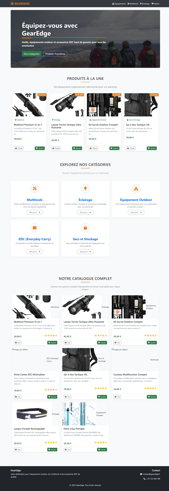
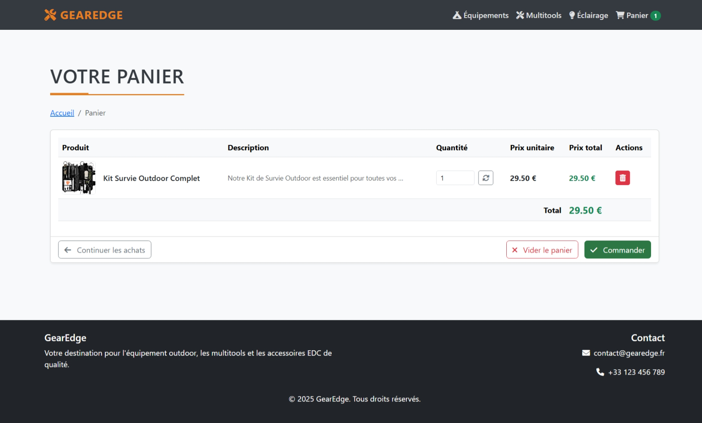

# GearEdge E-commerce

GearEdge est une application e-commerce Django qui présente une boutique en ligne pour des équipements outdoor, multitools, accessoires EDC (Everyday Carry), éclairage et matériel de camping.

[](https://github.com/Mohamed-Amine0/Ecommerce_exercice/blob/main/LICENSE)


## Fonctionnalités

### Implémentées
- ✅ Catalogue de produits avec affichage en grille
- ✅ Système de catégories pour organiser les produits
- ✅ Page détaillée par produit
- ✅ Mise en avant des produits populaires sur la page d'accueil
- ✅ Panier d'achat complet (ajout, suppression, mise à jour des quantités)
- ✅ Interface responsive avec design moderne
- ✅ Notifications utilisateur pour les actions du panier

### À venir
- ⏳ Système de recherche de produits
- ⏳ Système de comptes utilisateurs
- ⏳ Processus de commande et checkout
- ⏳ Système de paiement
- ⏳ Avis et notes sur les produits
- ⏳ Filtrage et tri avancés des produits

## 🛠️ Technologies utilisées

- **Backend**: Django 5.2
- **Frontend**: HTML5, CSS3, JavaScript, Bootstrap 5
- **Icônes**: FontAwesome
- **Base de données**: SQLite (développement)
- **Déploiement**: *(à venir)*

## 🧩 Structure du projet

```
ecommerce/              # Projet principal Django
│
├── products/           # Application pour les produits et catégories
│   ├── models.py       # Modèles de données (Product, Category)
│   ├── views.py        # Vues pour afficher les produits
│   ├── templates/      # Templates des pages produits
│   └── fixtures/       # Données de démo
│
├── cart/               # Application pour le panier d'achat
│   ├── cart.py         # Classe principale du panier
│   ├── views.py        # Vues pour gérer le panier
│   └── templates/      # Templates du panier
│
├── static/             # Fichiers statiques
│   ├── css/            # Styles CSS
│   └── js/             # Scripts JavaScript
│
└── templates/          # Templates de base partagés
```

## 🚀 Installation

1. Cloner le dépôt
   ```bash
   git clone https://github.com/Mohamed-Amine0/Ecommerce_exercice.git
   cd Ecommerce_exercice
   ```

2. Créer et activer un environnement virtuel
   ```bash
   # Windows
   python -m venv env
   env\Scripts\activate

   # Linux/Mac
   python -m venv env
   source env/bin/activate
   ```

3. Installer les dépendances
   ```bash
   pip install -r requirements.txt
   ```

4. Effectuer les migrations
   ```bash
   python manage.py migrate
   ```

5. Charger les données de démo
   ```bash
   python manage.py loaddata categories sample_products
   ```

6. Lancer le serveur
   ```bash
   python manage.py runserver
   ```

7. Ouvrir votre navigateur à l'adresse http://127.0.0.1:8000/

## 📸 Screenshots

### Page d'accueil


### Détail produit


### Panier d'achat


## 👥 Comment contribuer

Consultez [CONTRIBUTING.md](CONTRIBUTING.md) pour savoir comment contribuer au projet.

## 👨‍💻 Auteurs

- Team GearEdge

## 📄 Licence

Ce projet est sous licence MIT - voir le fichier [LICENSE](LICENSE) pour plus de détails.
